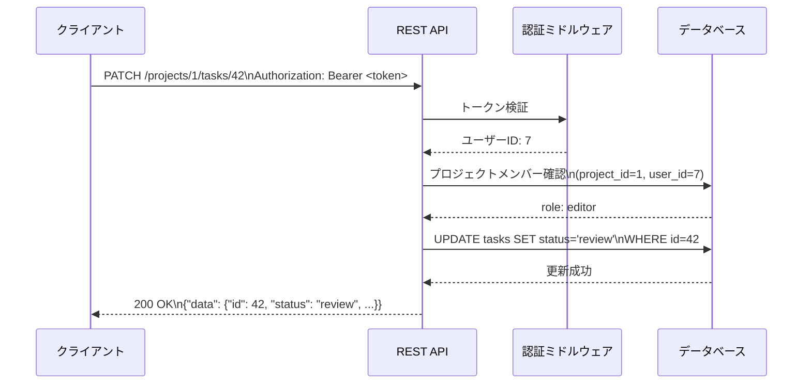

# はじめに

本書は、タスク管理 Web アプリケーションの REST API 仕様を定めるものです。
ベース URL は `https://api.example.com/api/v1` とします。

# 共通仕様

## 認証

すべてのエンドポイント（`/auth/*` を除く）は、リクエストヘッダーに JWT アクセストークンが必要です。

```
Authorization: Bearer <access_token>
```

## レスポンス形式

成功・失敗ともに JSON を返します。

**成功レスポンス:**

```json
{
  "data": { ... }
}
```

**エラーレスポンス:**

```json
{
  "error": {
    "code": "TASK_NOT_FOUND",
    "message": "指定されたタスクが見つかりません"
  }
}
```

## HTTPステータスコード

| コード | 意味 | 使用場面 |
|--------|------|---------|
| 200 | OK | 取得・更新成功 |
| 201 | Created | 新規作成成功 |
| 204 | No Content | 削除成功 |
| 400 | Bad Request | バリデーションエラー |
| 401 | Unauthorized | 未認証 |
| 403 | Forbidden | 権限なし |
| 404 | Not Found | リソースが存在しない |
| 409 | Conflict | 一意制約違反など |
| 500 | Internal Server Error | サーバー内部エラー |

# エンドポイント一覧

## 認証

| メソッド | パス | 説明 |
|---------|------|------|
| POST | `/auth/login` | ログイン（JWT取得） |
| POST | `/auth/refresh` | アクセストークン更新 |
| POST | `/auth/logout` | ログアウト |

## プロジェクト

| メソッド | パス | 説明 |
|---------|------|------|
| GET | `/projects` | プロジェクト一覧取得 |
| POST | `/projects` | プロジェクト作成 |
| GET | `/projects/{project_id}` | プロジェクト詳細取得 |
| PATCH | `/projects/{project_id}` | プロジェクト更新 |
| DELETE | `/projects/{project_id}` | プロジェクト削除 |

## タスク

| メソッド | パス | 説明 |
|---------|------|------|
| GET | `/projects/{project_id}/tasks` | タスク一覧取得 |
| POST | `/projects/{project_id}/tasks` | タスク作成 |
| GET | `/projects/{project_id}/tasks/{task_id}` | タスク詳細取得 |
| PATCH | `/projects/{project_id}/tasks/{task_id}` | タスク更新 |
| DELETE | `/projects/{project_id}/tasks/{task_id}` | タスク削除 |

## コメント

| メソッド | パス | 説明 |
|---------|------|------|
| GET | `/tasks/{task_id}/comments` | コメント一覧取得 |
| POST | `/tasks/{task_id}/comments` | コメント投稿 |
| DELETE | `/tasks/{task_id}/comments/{comment_id}` | コメント削除 |

# API 詳細

## POST /auth/login

ログインしてトークンを取得します。

**リクエスト:**

```json
{
  "email": "alice@example.com",
  "password": "s3cr3tP@ss"
}
```

**レスポンス: 200 OK**

```json
{
  "data": {
    "access_token": "eyJhbGci...",
    "refresh_token": "dGhpcyBp...",
    "expires_in": 900
  }
}
```

## GET /projects/{project_id}/tasks

プロジェクト内のタスク一覧を取得します。

**クエリパラメータ:**

| パラメータ | 型 | 必須 | デフォルト | 説明 |
|------------|-----|------|------------|------|
| status | string | 任意 | — | フィルター: todo / doing / review / done |
| priority | string | 任意 | — | フィルター: low / medium / high |
| assignee_id | integer | 任意 | — | 担当者IDでフィルター |
| sort | string | 任意 | created_at | ソートキー: created_at / due_date / priority |
| order | string | 任意 | desc | 昇順: asc / 降順: desc |
| page | integer | 任意 | 1 | ページ番号 |
| per_page | integer | 任意 | 20 | 件数（最大100） |

**レスポンス: 200 OK**

```json
{
  "data": {
    "tasks": [
      {
        "id": 42,
        "title": "ログイン画面の実装",
        "status": "doing",
        "priority": "high",
        "assignee": {
          "id": 7,
          "name": "Alice",
          "avatar_url": "https://example.com/avatars/7.png"
        },
        "due_date": "2026-07-01",
        "created_at": "2026-06-01T09:00:00Z",
        "updated_at": "2026-06-10T14:30:00Z"
      }
    ],
    "pagination": {
      "total": 128,
      "page": 1,
      "per_page": 20,
      "total_pages": 7
    }
  }
}
```

## POST /projects/{project_id}/tasks

タスクを新規作成します。

**リクエスト:**

```json
{
  "title": "APIドキュメントの整備",
  "description": "OpenAPI Specification を最新化する",
  "assignee_id": 7,
  "priority": "high",
  "due_date": "2026-07-15"
}
```

**バリデーション:**

| フィールド | 型 | 必須 | 制約 |
|------------|-----|------|------|
| title | string | 必須 | 1〜255文字 |
| description | string | 任意 | 最大10,000文字 |
| assignee_id | integer | 任意 | プロジェクトメンバーのID |
| priority | string | 任意 | low / medium / high |
| due_date | string | 任意 | ISO 8601 日付形式（YYYY-MM-DD） |

**レスポンス: 201 Created**

```json
{
  "data": {
    "id": 99,
    "title": "APIドキュメントの整備",
    "status": "todo",
    "priority": "high",
    "assignee": {
      "id": 7,
      "name": "Alice",
      "avatar_url": "https://example.com/avatars/7.png"
    },
    "due_date": "2026-07-15",
    "created_at": "2026-06-20T10:00:00Z",
    "updated_at": "2026-06-20T10:00:00Z"
  }
}
```

## PATCH /projects/{project_id}/tasks/{task_id}

タスクを部分更新します。指定したフィールドのみ更新されます。

**リクエスト例（ステータス変更）:**

```json
{
  "status": "review"
}
```

**リクエスト例（担当者と期限を変更）:**

```json
{
  "assignee_id": 12,
  "due_date": "2026-08-01"
}
```

# リクエスト・レスポンスフロー



# エラーコード一覧

| コード | HTTPステータス | 説明 |
|--------|--------------|------|
| INVALID_CREDENTIALS | 401 | メールまたはパスワードが不正 |
| TOKEN_EXPIRED | 401 | アクセストークンの期限切れ |
| FORBIDDEN | 403 | 操作権限なし |
| PROJECT_NOT_FOUND | 404 | プロジェクトが存在しない |
| TASK_NOT_FOUND | 404 | タスクが存在しない |
| VALIDATION_ERROR | 400 | 入力値バリデーションエラー |
| MEMBER_NOT_FOUND | 404 | 指定ユーザーがメンバーでない |
