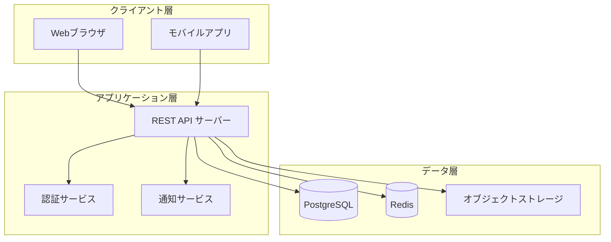
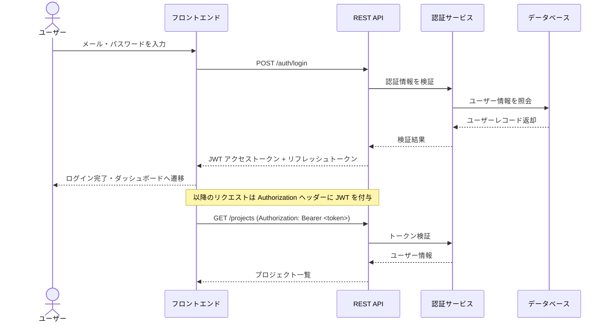
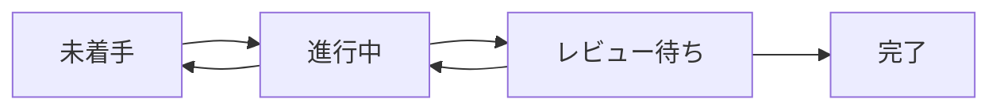

# はじめに

本書は、タスク管理 Web アプリケーション（以下「本システム」）の基本設計を定めるものです。
開発チーム・レビュアーが共通認識を持てるよう、システム概要・アーキテクチャ・主要機能・API 設計を記載します。

## 対象読者

- バックエンド / フロントエンド エンジニア
- インフラ担当者
- プロジェクトマネージャー

## 用語定義

| 用語 | 定義 |
|------|------|
| タスク | ユーザーが登録する作業単位。ステータス・期限・担当者を持つ |
| プロジェクト | 複数のタスクをまとめる管理単位 |
| ワークスペース | 組織単位。複数のプロジェクトを含む |

# システム概要

## 目的

チームのタスクを一元管理し、進捗の可視化と担当者間のコラボレーションを支援する。

## システム構成

本システムは以下の 3 層構成を採用する。



## 主要コンポーネント

| コンポーネント | 技術スタック | 役割 |
|----------------|--------------|------|
| フロントエンド | React / TypeScript | SPA によるユーザー操作 |
| バックエンド API | Go / Echo | ビジネスロジック・データ操作 |
| 認証サービス | JWT + OAuth2 | ユーザー認証・認可 |
| データベース | PostgreSQL 16 | 永続データ管理 |
| キャッシュ | Redis 7 | セッション・高頻度クエリのキャッシュ |

# 機能設計

## ユーザー認証フロー

ログインから API アクセスまでのシーケンスを示す。



## タスクのステータス遷移



## API 設計

### タスク一覧取得

**エンドポイント:** `GET /api/v1/projects/{project_id}/tasks`

**クエリパラメータ:**

| パラメータ | 型 | 必須 | 説明 |
|------------|-----|------|------|
| status | string | 任意 | フィルター（todo / doing / review / done） |
| assignee_id | integer | 任意 | 担当者 ID によるフィルター |
| page | integer | 任意 | ページ番号（デフォルト: 1） |
| per_page | integer | 任意 | 1ページあたりの件数（デフォルト: 20, 最大: 100） |

**レスポンス例:**

```json
{
  "tasks": [
    {
      "id": 42,
      "title": "ログイン画面の実装",
      "status": "doing",
      "assignee": {
        "id": 7,
        "name": "Alice",
        "avatar_url": "https://example.com/avatars/7.png"
      },
      "due_date": "2026-07-01",
      "created_at": "2026-06-01T09:00:00Z"
    }
  ],
  "pagination": {
    "total": 128,
    "page": 1,
    "per_page": 20
  }
}
```

### タスク作成

**エンドポイント:** `POST /api/v1/projects/{project_id}/tasks`

```json
{
  "title": "API ドキュメントの整備",
  "description": "OpenAPI Specification を最新化する",
  "assignee_id": 7,
  "due_date": "2026-07-15",
  "priority": "high"
}
```

# データ設計

## テーブル定義（主要テーブル）

```sql
CREATE TABLE tasks (
    id          BIGSERIAL PRIMARY KEY,
    project_id  BIGINT      NOT NULL REFERENCES projects(id),
    title       VARCHAR(255) NOT NULL,
    description TEXT,
    status      VARCHAR(20)  NOT NULL DEFAULT 'todo'
                CHECK (status IN ('todo', 'doing', 'review', 'done')),
    priority    VARCHAR(10)  NOT NULL DEFAULT 'medium'
                CHECK (priority IN ('low', 'medium', 'high')),
    assignee_id BIGINT REFERENCES users(id),
    due_date    DATE,
    created_at  TIMESTAMPTZ  NOT NULL DEFAULT NOW(),
    updated_at  TIMESTAMPTZ  NOT NULL DEFAULT NOW()
);

CREATE INDEX idx_tasks_project_status ON tasks(project_id, status);
CREATE INDEX idx_tasks_assignee       ON tasks(assignee_id);
```

# 非機能要件

## パフォーマンス目標

| 指標 | 目標値 |
|------|--------|
| API レスポンスタイム（p95） | 200ms 以内 |
| 同時接続ユーザー数 | 500 ユーザー |
| データベース最大レコード数 | タスク 1,000 万件 |

## セキュリティ方針

- 通信はすべて HTTPS（TLS 1.3）を使用する
- パスワードは bcrypt（コストファクター 12）でハッシュ化して保存する
- JWT の有効期限はアクセストークン 15 分、リフレッシュトークン 7 日とする
- API には認証が必要であり、権限のないリソースへのアクセスは 403 を返す

# まとめ

本書では、タスク管理 Web アプリケーションの基本設計として以下を定めた。

1. **3層アーキテクチャ** — クライアント・アプリケーション・データの責務を分離する
2. **JWT 認証** — ステートレスな API 認証によりスケールアウトを容易にする
3. **REST API** — リソース指向の設計で直感的なインターフェースを提供する
4. **PostgreSQL + Redis** — 永続性とキャッシュ性能を組み合わせる

次フェーズでは詳細設計・テスト計画を策定する。
