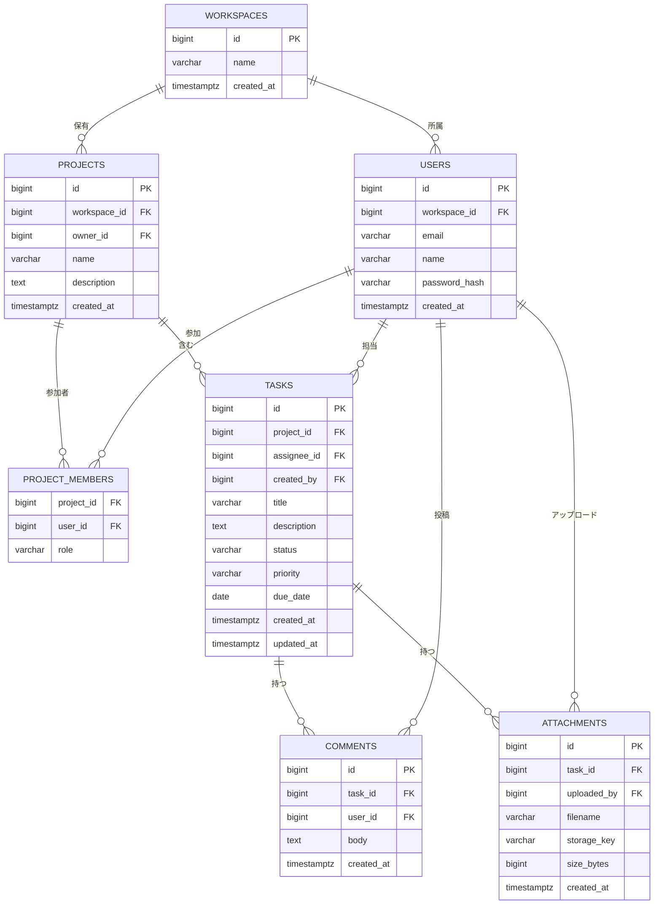

# はじめに

本書は、タスク管理 Web アプリケーションのデータベース設計を定めるものです。
エンティティ関係・テーブル定義・インデックス設計を記載します。

# エンティティ関係図



# テーブル定義

## workspaces（ワークスペース）

| カラム | 型 | 制約 | 説明 |
|--------|----|------|------|
| id | BIGSERIAL | PK | ワークスペースID |
| name | VARCHAR(100) | NOT NULL | ワークスペース名 |
| plan | VARCHAR(20) | NOT NULL, DEFAULT 'free' | プラン（free / pro / enterprise） |
| created_at | TIMESTAMPTZ | NOT NULL, DEFAULT NOW() | 作成日時 |

## users（ユーザー）

| カラム | 型 | 制約 | 説明 |
|--------|----|------|------|
| id | BIGSERIAL | PK | ユーザーID |
| workspace_id | BIGINT | FK → workspaces.id | 所属ワークスペース |
| email | VARCHAR(255) | NOT NULL, UNIQUE | メールアドレス |
| name | VARCHAR(100) | NOT NULL | 表示名 |
| password_hash | VARCHAR(255) | NOT NULL | bcrypt ハッシュ |
| avatar_url | TEXT | | アバター画像URL |
| created_at | TIMESTAMPTZ | NOT NULL, DEFAULT NOW() | 作成日時 |

## projects（プロジェクト）

| カラム | 型 | 制約 | 説明 |
|--------|----|------|------|
| id | BIGSERIAL | PK | プロジェクトID |
| workspace_id | BIGINT | FK → workspaces.id | 所属ワークスペース |
| owner_id | BIGINT | FK → users.id | オーナーユーザー |
| name | VARCHAR(255) | NOT NULL | プロジェクト名 |
| description | TEXT | | 説明 |
| archived | BOOLEAN | NOT NULL, DEFAULT FALSE | アーカイブ済みフラグ |
| created_at | TIMESTAMPTZ | NOT NULL, DEFAULT NOW() | 作成日時 |

## tasks（タスク）

| カラム | 型 | 制約 | 説明 |
|--------|----|------|------|
| id | BIGSERIAL | PK | タスクID |
| project_id | BIGINT | FK → projects.id | 所属プロジェクト |
| assignee_id | BIGINT | FK → users.id | 担当者（NULL可） |
| created_by | BIGINT | FK → users.id | 作成者 |
| title | VARCHAR(255) | NOT NULL | タイトル |
| description | TEXT | | 詳細説明 |
| status | VARCHAR(20) | NOT NULL, DEFAULT 'todo' | ステータス |
| priority | VARCHAR(10) | NOT NULL, DEFAULT 'medium' | 優先度 |
| due_date | DATE | | 期限 |
| created_at | TIMESTAMPTZ | NOT NULL, DEFAULT NOW() | 作成日時 |
| updated_at | TIMESTAMPTZ | NOT NULL, DEFAULT NOW() | 更新日時 |

# DDL

```sql
CREATE TABLE workspaces (
    id         BIGSERIAL    PRIMARY KEY,
    name       VARCHAR(100) NOT NULL,
    plan       VARCHAR(20)  NOT NULL DEFAULT 'free'
               CHECK (plan IN ('free', 'pro', 'enterprise')),
    created_at TIMESTAMPTZ  NOT NULL DEFAULT NOW()
);

CREATE TABLE users (
    id            BIGSERIAL    PRIMARY KEY,
    workspace_id  BIGINT       NOT NULL REFERENCES workspaces(id),
    email         VARCHAR(255) NOT NULL,
    name          VARCHAR(100) NOT NULL,
    password_hash VARCHAR(255) NOT NULL,
    avatar_url    TEXT,
    created_at    TIMESTAMPTZ  NOT NULL DEFAULT NOW(),
    UNIQUE (workspace_id, email)
);

CREATE TABLE projects (
    id           BIGSERIAL    PRIMARY KEY,
    workspace_id BIGINT       NOT NULL REFERENCES workspaces(id),
    owner_id     BIGINT       NOT NULL REFERENCES users(id),
    name         VARCHAR(255) NOT NULL,
    description  TEXT,
    archived     BOOLEAN      NOT NULL DEFAULT FALSE,
    created_at   TIMESTAMPTZ  NOT NULL DEFAULT NOW()
);

CREATE TABLE project_members (
    project_id BIGINT      NOT NULL REFERENCES projects(id),
    user_id    BIGINT      NOT NULL REFERENCES users(id),
    role       VARCHAR(20) NOT NULL DEFAULT 'member'
               CHECK (role IN ('owner', 'editor', 'member', 'viewer')),
    PRIMARY KEY (project_id, user_id)
);

CREATE TABLE tasks (
    id          BIGSERIAL    PRIMARY KEY,
    project_id  BIGINT       NOT NULL REFERENCES projects(id),
    assignee_id BIGINT       REFERENCES users(id),
    created_by  BIGINT       NOT NULL REFERENCES users(id),
    title       VARCHAR(255) NOT NULL,
    description TEXT,
    status      VARCHAR(20)  NOT NULL DEFAULT 'todo'
                CHECK (status IN ('todo', 'doing', 'review', 'done')),
    priority    VARCHAR(10)  NOT NULL DEFAULT 'medium'
                CHECK (priority IN ('low', 'medium', 'high')),
    due_date    DATE,
    created_at  TIMESTAMPTZ  NOT NULL DEFAULT NOW(),
    updated_at  TIMESTAMPTZ  NOT NULL DEFAULT NOW()
);

-- インデックス
CREATE INDEX idx_tasks_project_status ON tasks(project_id, status);
CREATE INDEX idx_tasks_assignee        ON tasks(assignee_id);
CREATE INDEX idx_tasks_due_date        ON tasks(due_date) WHERE due_date IS NOT NULL;
CREATE INDEX idx_users_workspace       ON users(workspace_id);
```

# インデックス設計方針

| インデックス | 対象クエリ |
|-------------|-----------|
| `idx_tasks_project_status` | プロジェクト内のステータス別タスク一覧 |
| `idx_tasks_assignee` | 担当者別タスク一覧 |
| `idx_tasks_due_date` | 期限切れ・期限間近タスクの抽出 |
| `idx_users_workspace` | ワークスペース内ユーザー一覧 |

期限が NULL のタスクは期限クエリに不要なため、`idx_tasks_due_date` は部分インデックスとする。
